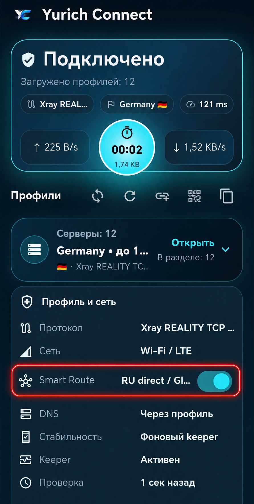
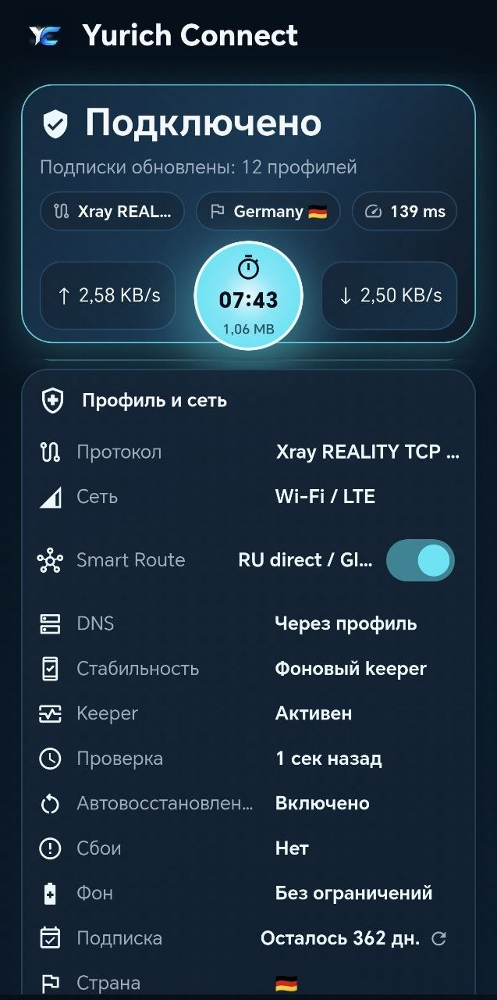
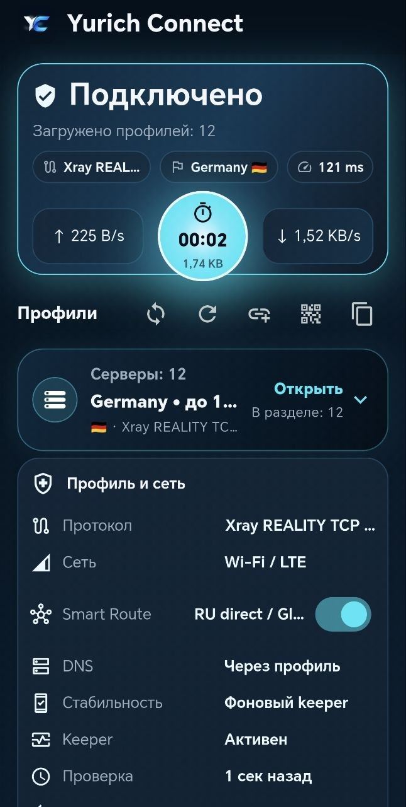
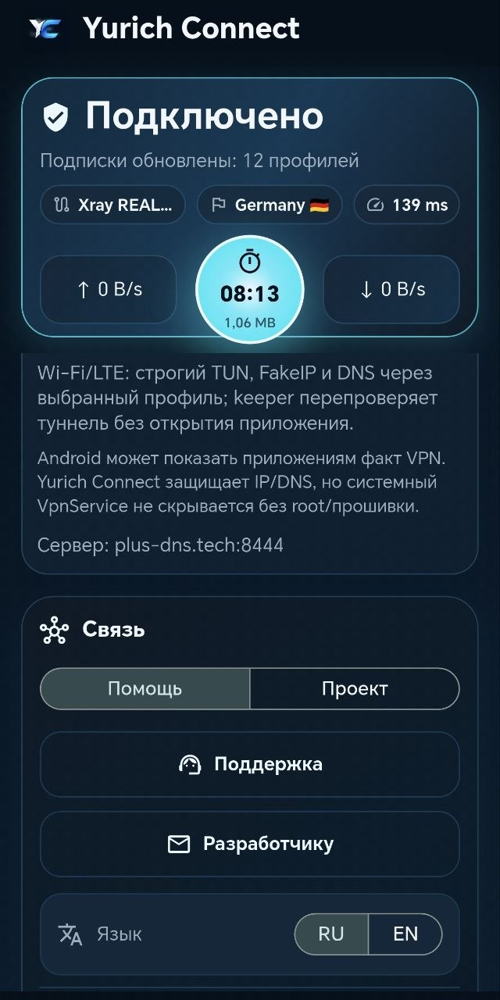

# Yurich Connect Android

Yurich Connect is a gold/dark Android VPN client powered by sing-box. It focuses on
simple profile import, stable reconnects, protected DNS, and clear diagnostics
for VLESS Reality, VLESS TLS, NaiveProxy, Remnawave subscriptions, and sing-box
JSON profiles. XHTTP is available as an experimental Xray-core transport.

Русская версия ниже.

## Download

Use the GitHub Release asset:

- `YurichConnect-android-release.apk`
- Releases: [ivan-yurich/Yurich-Connect-Android](https://github.com/ivan-yurich/Yurich-Connect-Android/releases)

Android may warn about APKs installed outside Google Play until the app is
published and verified by Play Protect.

## Features

- Import from Remnawave subscription links, single `vless://` links,
  `naive+https://` links, clipboard, QR code, and sing-box JSON.
- Android VPNService integration through the bundled sing-box plugin.
- Persistent Android notification with connection status and traffic.
- Protected DNS through the VPN tunnel with explicit endpoint bootstrap and
  IPv4/IPv6 leak protection.
- Wi-Fi and LTE compatible TUN settings with gVisor stack and strict routing.
- Two languages: Russian and English.
- Built-in diagnostics report with sensitive values redacted before sharing.

## Screenshots

| Connection and Smart Route | Profile and network | Compact profile picker |
| --- | --- | --- |
|  |  |  |



## Build

Install Flutter and Android SDK, then run:

```powershell
flutter pub get
flutter analyze
flutter test
flutter build apk --release --flavor github
flutter build appbundle --release --flavor play
```

The release APK is created at:

```text
build/app/outputs/flutter-apk/app-github-release.apk
build/app/outputs/bundle/playRelease/app-play-release.aab
```

## Release Checklist

1. Build the GitHub APK and Play AAB with the release keystore outside git.
2. Verify both signatures and package identity.
3. Upload the APK to GitHub Releases and the AAB to Google Play Console.
4. Complete the VPN service, foreground service, Data safety, and privacy policy
   declarations described in [`PLAY_RELEASE.md`](PLAY_RELEASE.md).
5. Keep signing files, real VPN profiles, subscriptions, and production configs
   out of git.

## Links

- Site: [ivan-it.net](https://ivan-it.net)
- Email: [ai@ivan-it.net](mailto:ai@ivan-it.net)
- VK: [vk.com/ivan_yurievich_it](https://vk.com/ivan_yurievich_it)
- Donate: [dzen.ru/ivanyurievich?donate=true](https://dzen.ru/ivanyurievich?donate=true)

## Русский

Yurich Connect Android — Android-клиент VPN в золотом стиле на базе sing-box. Он
умеет импортировать профили из Remnawave, `vless://`, `naive+https://`, QR,
буфера и sing-box JSON.

### Возможности

- VLESS Reality, VLESS TLS, Hysteria2, NaiveProxy, sing-box JSON и
  экспериментальный XHTTP через Xray-core.
- Защищённый DNS через VPN-туннель.
- Настройки TUN для Wi-Fi и LTE.
- Шторка Android со статусом подключения и трафиком.
- Русский и английский интерфейс.
- Диагностический отчёт с автоматическим скрытием чувствительных данных.

### Скриншоты

Скриншоты интерфейса лежат в [`promo/screenshots`](promo/screenshots): экран
подключения, Smart Route, профиль и сеть, компактный список серверов и блок
связи.

### Сборка

```powershell
flutter pub get
flutter analyze
flutter test
flutter build apk --release --flavor github
flutter build appbundle --release --flavor play
```

APK будет здесь:

```text
build/app/outputs/flutter-apk/app-github-release.apk
build/app/outputs/bundle/playRelease/app-play-release.aab
```

Windows-версия ведётся отдельно в репозитории
[`ivan-yurich/yurich-connect-windows`](https://github.com/ivan-yurich/yurich-connect-windows).
