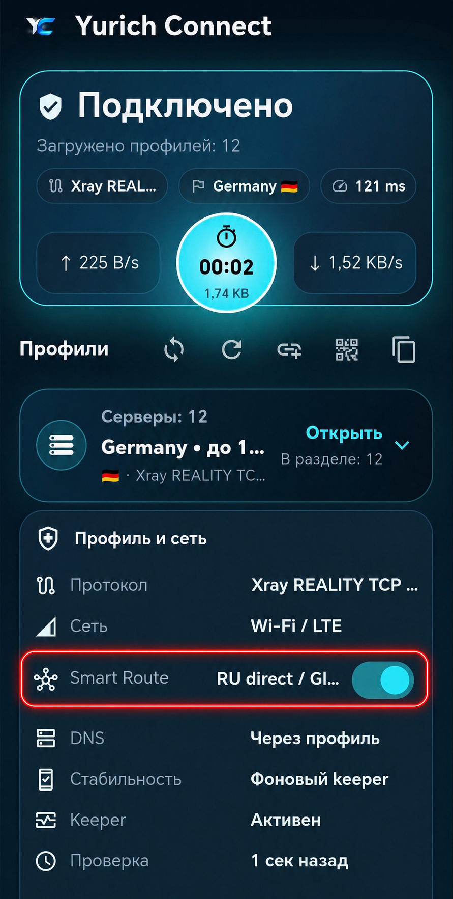
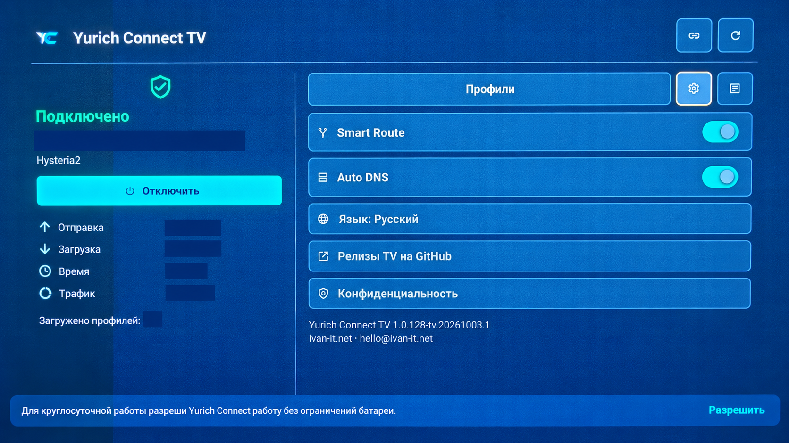
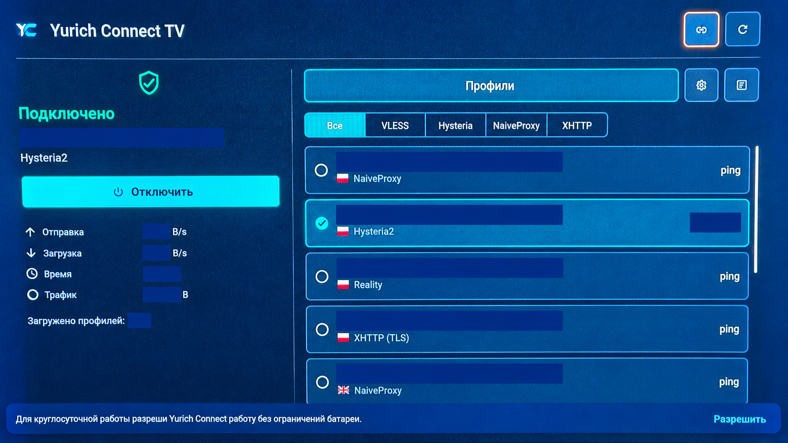
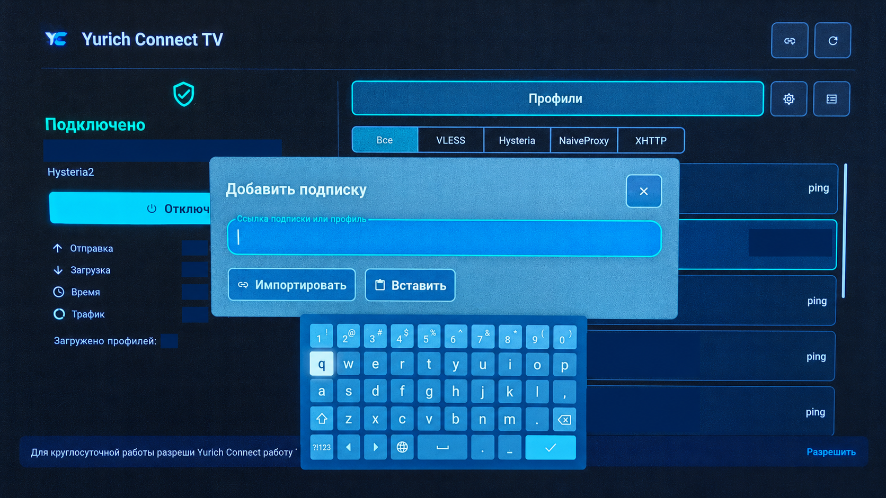

<div align="center">
  
  <h1>Yurich Connect</h1>
  <p>VPN-клиент Ивана Юрьевича для Android и Android TV на базе sing-box и Xray.</p>
  <p>Подписки, Smart Route, Auto DNS и фоновое восстановление соединения.</p>
  <p>
    <a href="https://github.com/ivan-yurich/Yurich-Connect-Android/releases/latest"></a>
    
    <a href="https://github.com/ivan-yurich/Yurich-Connect-Android/actions/workflows/android.yml"></a>
  </p>
  <p>
    <a href="https://github.com/ivan-yurich/Yurich-Connect-Android/releases/latest/download/YurichConnect-android-release.apk"><strong>Скачать APK</strong></a>
    · <a href="https://github.com/ivan-yurich/Yurich-Connect-Android/releases">История релизов</a>
    · <a href="docs/ANDROID_TV.md">Android TV</a>
    · <a href="https://ivan-it.net/">Сайт автора</a>
    · <a href="https://t.me/ivan_it_net">Telegram</a>
  </p>
</div>

## Возможности

- Импорт подписки по ссылке, профилей из буфера обмена и QR-кодов.
- Reality, VLESS TLS, NaiveProxy, Hysteria2 и экспериментальный XHTTP.
- Smart Route: известные российские сервисы напрямую, остальные направления через VPN.
- Auto DNS с настройками, учитывающими особенности протокола.
- Фоновый VPN-сервис с внешними проверками доступности и автовосстановлением.
- Статус, время подключения и счётчики трафика в приложении и уведомлении Android.
- Русский и английский интерфейс; локальная диагностика со скрытием известных секретов.
- Опциональная [диагностика на телефоне за 7 дней](docs/ON_DEVICE_DIAGNOSTICS.md)
  без подключения к компьютеру, с ручным экспортом ZIP.
- Проверка обновлений GitHub-сборки и проверка подписи APK перед установкой.

Приложение является клиентом: для подключения нужна действующая подписка или собственный VPN-сервер. Работа зависит также от сервера, оператора и ограничений Android.

## Установка

1. Скачайте `YurichConnect-android-release.apk` из [последнего релиза](https://github.com/ivan-yurich/Yurich-Connect-Android/releases/latest).
2. Если Android запросит разрешение на установку из этого источника, разрешите её для используемого браузера или файлового менеджера.
3. Откройте приложение и добавьте свою подписку через кнопку добавления профиля либо QR-сканер.
4. Выберите профиль, включите подключение и подтвердите системный запрос Android на создание VPN.
5. Откройте сайт в браузере и проверьте реальную доступность интернета, а не только счётчик трафика.

Для фоновой работы разрешите уведомления и проверьте ограничения батареи для приложения в настройках телефона. Это помогает сервису работать в фоне, но не гарантирует непрерывность на любой прошивке.

**Требования опубликованного APK:** Android 7.0 / API 24 и устройство ARM64 (`arm64-v8a`). **Package:** `online.dnsai.ivanvpn`. Наличие библиотек других архитектур внутри APK не означает поддержку 32-битного Android или x86: Flutter-runtime в этом артефакте собран для ARM64.

Обновление с той же подписью устанавливается поверх приложения без очистки профилей. Не удаляйте приложение перед обновлением. Контрольные суммы доступны вместе с APK в релизе.

### Тестовая Android-Сборка

Доступен кандидат **1.0.128-test.20261007.9**: исправлены счётчики после смены
профиля, ожидание завершения VPN-процесса и окно готовности Hysteria2;
уточнены диагностика и ограничения повторных восстановлений.

**Не для стабильного канала:** в итоговой проверке прошли 27/32 переключения
профилей и 8/8 проверок Chrome на LTE/Wi-Fi. Отказы готовности Hysteria2/Reality
и причины двух SIGKILL ещё исследуются. Непрерывная работа 24/7 не подтверждена.

[Тестовый релиз и APK](https://github.com/ivan-yurich/Yurich-Connect-Android/releases/tag/v1.0.128-test.20261007.9) ·
[Изменения, проверки и откат](docs/releases/v1.0.128-test.20261007.9.md).
Установка только вручную, Android 7.0+ и ARM64. Стабильный APK выше и отдельный
TV-релиз не заменяются; обычное автообновление не предлагает prerelease.

## Протоколы

| Название в интерфейсе | Технология | Когда использовать |
| --- | --- | --- |
| **Reality** | VLESS Reality, TCP | Основной вариант; точный transport определяется профилем |
| **NaiveProxy** | HTTPS / TCP | Совместимость с сетями, где UDP недоступен |
| **Hysteria2** | QUIC / UDP | Видео и загрузки в сетях, разрешающих UDP |
| **XHTTP** | VLESS XHTTP, TLS или Reality | Дополнительный экспериментальный вариант через Xray |

Названия соответствуют технологиям. Hysteria первой версии и Hysteria2 различаются в профилях; обе версии собраны в разделе Hysteria. Вкладка VLESS объединяет Reality, VLESS TLS и XHTTP. Названия серверов в самой подписке могут отличаться от подписей протоколов в приложении.

XHTTP требует совместимого сервера и конфигурации. `XHTTP (TLS)` и `XHTTP (REALITY)` показываются отдельно. Если UDP блокируется, попробуйте Reality или NaiveProxy.

PingTunnel удалён из поддерживаемых протоколов. Произвольный sing-box JSON может импортироваться, но его запуск из пользовательского интерфейса пока недоступен; mKCP также не заявляется как рабочий вариант.

## Smart Route И DNS

**Smart Route** применяет списки доменов и разрешённых приложений. Известные российские сервисы могут идти напрямую; зарубежные и неизвестные направления остаются в VPN. Приложение не отправляет любой пакет `ru.*` напрямую только из-за имени. При прямом маршруте сервис видит обычный IP оператора: это осознанное разделение трафика, а не режим полной анонимности.

**Auto DNS** управляет DNS внутри VPN-конфигурации. Для NaiveProxy сохраняется локальное разрешение адреса сервера (bootstrap) ради совместимости. Поэтому приложение не заявляет абсолютное отсутствие любых DNS-запросов вне туннеля во всех режимах.

Переключение этих настроек при активном VPN может вызвать короткое переподключение. В сети с captive portal сначала выполните вход в Wi-Fi, затем включите VPN. Подробные инструкции доступны в FAQ приложения.

## Интерфейс

<p align="center">
  
</p>

Иллюстрация интерфейса; названия, доступные профили и показатели зависят от версии и подписки. Другие снимки находятся в [`promo/screenshots`](promo/screenshots).

## Yurich Connect TV

Отдельный интерфейс для телевизоров и приставок: управление пультом,
горизонтальная компоновка, подписки и настройки сети на одном экране.
TV-версия использует VPN-ядро мобильного клиента, а не растянутый телефонный UI.

<p align="center">
  
</p>

<p align="center">
  
  
</p>

- Управление стрелками и OK, видимый фокус, прокрутка длинного списка профилей.
- Импорт подписки через экранную клавиатуру или явное действие «Вставить».
- Reality, NaiveProxy, Hysteria2 и экспериментальный XHTTP через общее VPN-ядро.
- Smart Route, Auto DNS, русский/английский интерфейс и просмотр логов.
- Отдельный TV APK для ARM32/ARM64; Android 7.0 / API 24 или новее.
- Обновление вручную **только TV APK**; телефонная сборка не скачивается.

**Статус: предварительная TV-версия `1.0.128-tv.20261003.1`.**
[Скачать TV APK](https://github.com/ivan-yurich/Yurich-Connect-Android/releases/download/v1.0.128-tv.20261003.1/YurichConnect-TV-arm-v1.0.128-tv.20261003.1.apk) ·
[Страница TV-релиза](https://github.com/ivan-yurich/Yurich-Connect-Android/releases/tag/v1.0.128-tv.20261003.1)

Фотографии устройства показывают лаунчер и экраны приложения. Иллюстрации
кадрированы и отретушированы генеративным редактором; личные данные скрыты.
Они не являются замерами сети или подтверждением стабильности 24/7.

[Установка и совместимость](docs/ANDROID_TV.md) ·
[Описание TV-релиза](docs/releases/v1.0.128-tv.20261003.1.md) ·
[Полная галерея](promo/screenshots/tv/README.md) ·
[Порядок публикации](docs/TV_PUBLICATION.md)

## Релиз 1.0.127

- Новые публичные названия: Hysteria → **ИИ**, NaiveProxy → **Веб**.
- Приостановлены анимация и обновление UI-таймера в фоне; VPN-мониторинг продолжает работать.
- Ограничено время импорта подписки и ожидания зависшей загрузки обновления.
- Smart Route больше не доверяет неизвестным приложениям по префиксу `ru.*`.
- Исправлена подпись TLS-XHTTP в статусе, списке и диагностике.

Проверены **140 Flutter-тестов** и **96 Android-тестов**. На HONOR с Android 16 выполнены короткие проверки четырёх типов протоколов на LTE и Wi-Fi, браузера и фонового восстановления после потери сети. Это не сертификация стабильности 24/7 и не проверка всех серверов или устройств.

Подробнее: [заметки релиза](docs/releases/v1.0.127.md) и [CHANGELOG](CHANGELOG.md).

## Разработка

### Android TV

Добавлен отдельный вариант `tv`: горизонтальный интерфейс с управлением пультом,
подписками, Smart Route, Auto DNS и логами. Он использует существующее VPN-ядро;
телефонный интерфейс не заменён. TV APK для ARM32/ARM64 собирается командой
`.\tooling\build_tv.ps1`. Подробности, ограничения и установка:
[Android TV](docs/ANDROID_TV.md). Внешний интернет, сон и восстановление сети на
физической приставке требуют отдельной проверки.

### Android Для Телефона

Стек: Flutter / Dart, Android Kotlin, sing-box и Xray. Нужны Flutter SDK, Android SDK / NDK и JDK 17. Версия Flutter для CI указана в [workflow](.github/workflows/android.yml).

```powershell
flutter pub get
flutter analyze --no-pub
flutter test --no-pub
./android/gradlew.bat -p android :flutter_singbox_vpn:testDebugUnitTest
flutter build apk --release --flavor github --no-pub
```

Результат: `build/app/outputs/flutter-apk/app-github-release.apk`. Для подписанной сборки нужен собственный keystore и локальный `android/key.properties`; без настройки подписи сборка не является официальным APK и не заменит его на устройстве. Ключи и пароли нельзя публиковать в Git.

Канал `github` получает APK из GitHub Releases. Канал `play` предназначен для Google Play и не использует внешнюю установку обновлений. Подготовка Play-сборки описана в [PLAY_RELEASE.md](PLAY_RELEASE.md); наличие этого канала не означает публикацию в магазине.

## Безопасность И Поддержка

Профили хранятся с использованием Android Keystore; runtime-конфигурации шифруются перед сохранением. Политики проекта: [конфиденциальность](PRIVACY.md) и [сообщение об уязвимости](SECURITY.md).

Обычный баг можно описать в [GitHub Issues](https://github.com/ivan-yurich/Yurich-Connect-Android/issues): версия приложения, Android, тип протокола, сеть и шаги воспроизведения. Перед отправкой диагностики просмотрите её вручную. Не публикуйте подписки, QR-коды доступа, UUID, пароли и ключи; уязвимости сообщайте приватно по email.

## Автор И Контакты

**Иван Юрьевич** — разработка и развитие Yurich Connect.

| Канал | Адрес |
| --- | --- |
| Сайт | [ivan-it.net](https://ivan-it.net/) |
| VK | [Иван Юрьевич TV](https://vk.ru/ivanyurievichtv) |
| Telegram | [@ivan_it_net](https://t.me/ivan_it_net) |
| Email | [hello@ivan-it.net](mailto:hello@ivan-it.net) |

Windows-клиент развивается отдельно: [Yurich Connect Windows](https://github.com/ivan-yurich/yurich-connect-windows).

<details>
<summary>English Overview</summary>

Yurich Connect is an Android VPN client built with Flutter, Kotlin, sing-box and Xray. It supports subscription import, Reality, NaiveProxy, Hysteria2, experimental XHTTP, Smart Route and Auto DNS. A valid VPN subscription or server is required. Download the signed APK from GitHub Releases; do not uninstall the app before updating. Short device checks do not establish 24/7 reliability. Contact: [hello@ivan-it.net](mailto:hello@ivan-it.net).

</details>
