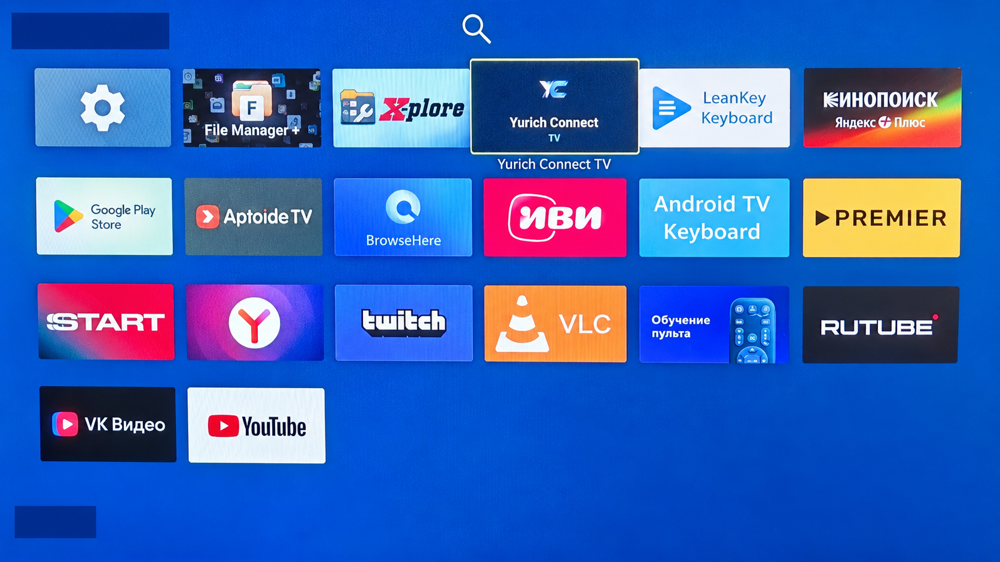
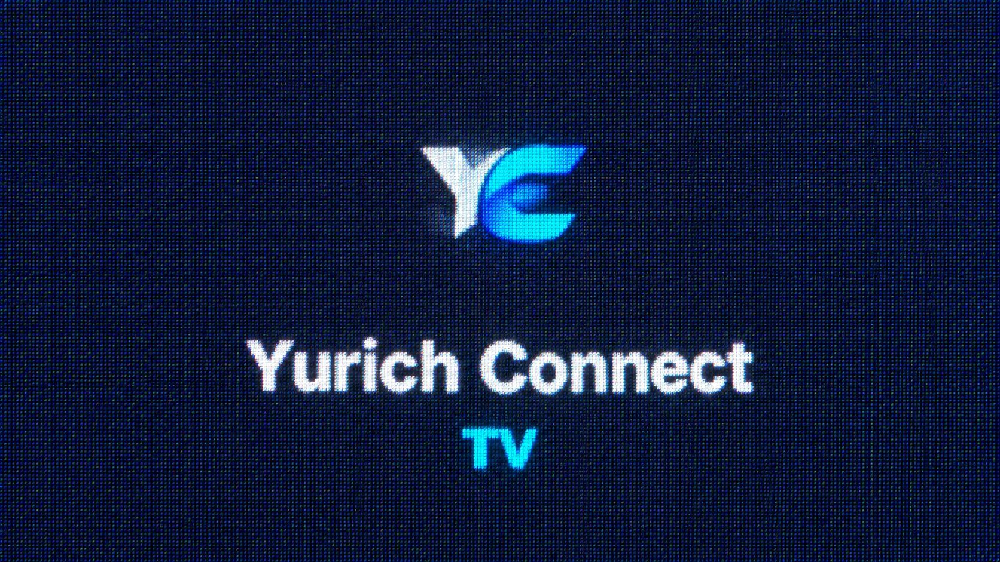
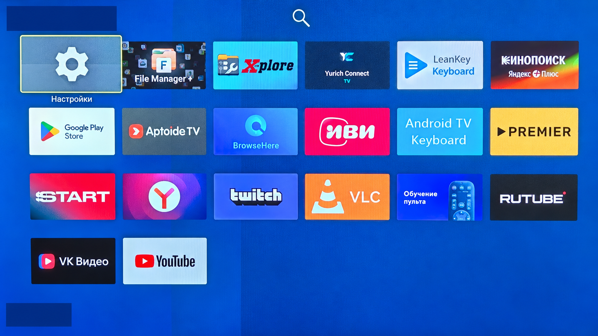

# Yurich Connect TV: Галерея

Иллюстрации интерфейса для страницы проекта и заметок TV-релиза.

Все шесть изображений подготовлены на основе фотографий устройства с помощью
генеративного редактора: кадрирование экрана, выравнивание и ретушь отражений.
Реальные названия профилей, имена, сроки подписки и показатели сеанса скрыты
непрозрачными масками. Домашняя обстановка не включена в публичные материалы.
Иллюстрации не являются исходными снимками, сетевыми замерами или доказательством
стабильности протоколов; обработка могла изменить мелкие детали изображения.

## Настройки

## Профили

## Импорт Подписки

## Лаунчер

## Плитка Приложения

## Общий Вид Лаунчера

Публичные контакты автора сохранены намеренно: `ivan-it.net`, `hello@ivan-it.net`.
Оригинальные фотографии и необработанные данные не входят в комплект публикации.

[Установка и совместимость](../../../docs/ANDROID_TV.md) ·
[Описание TV-релиза](../../../docs/releases/v1.0.128-tv.20261003.1.md)
